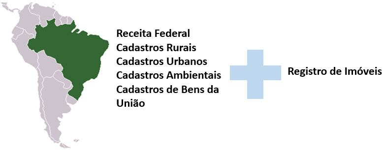
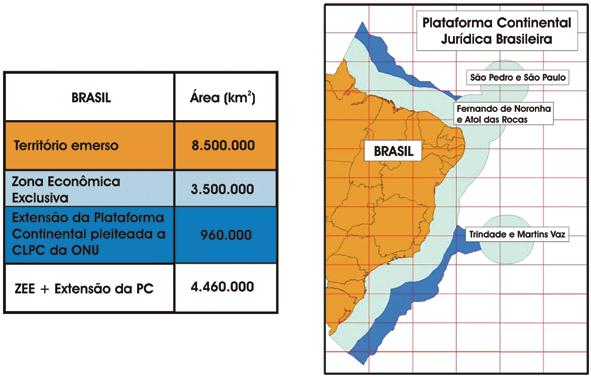
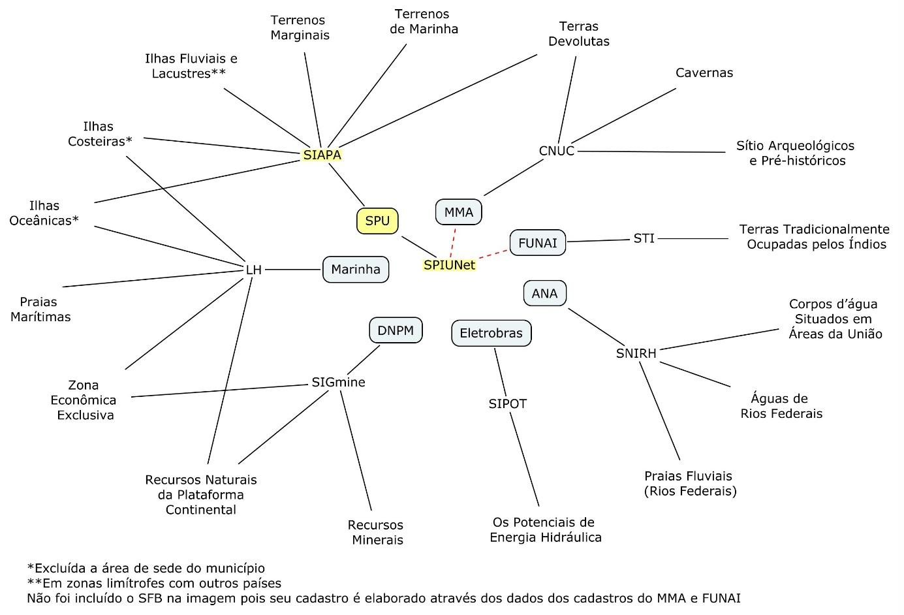
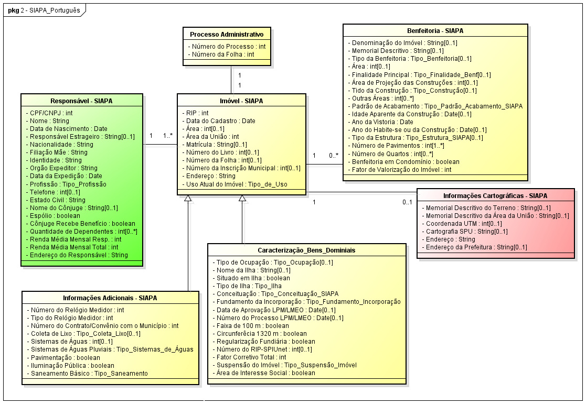
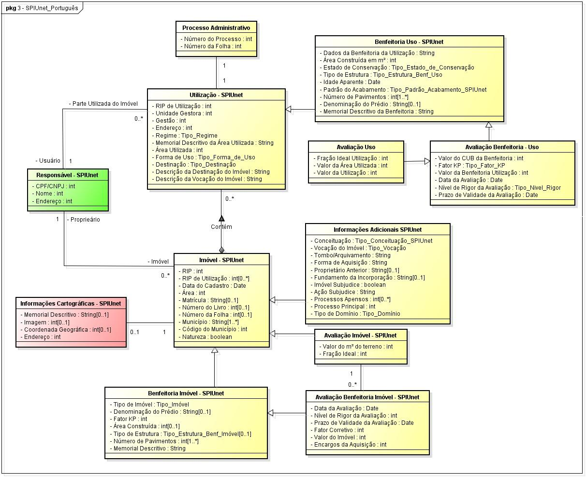
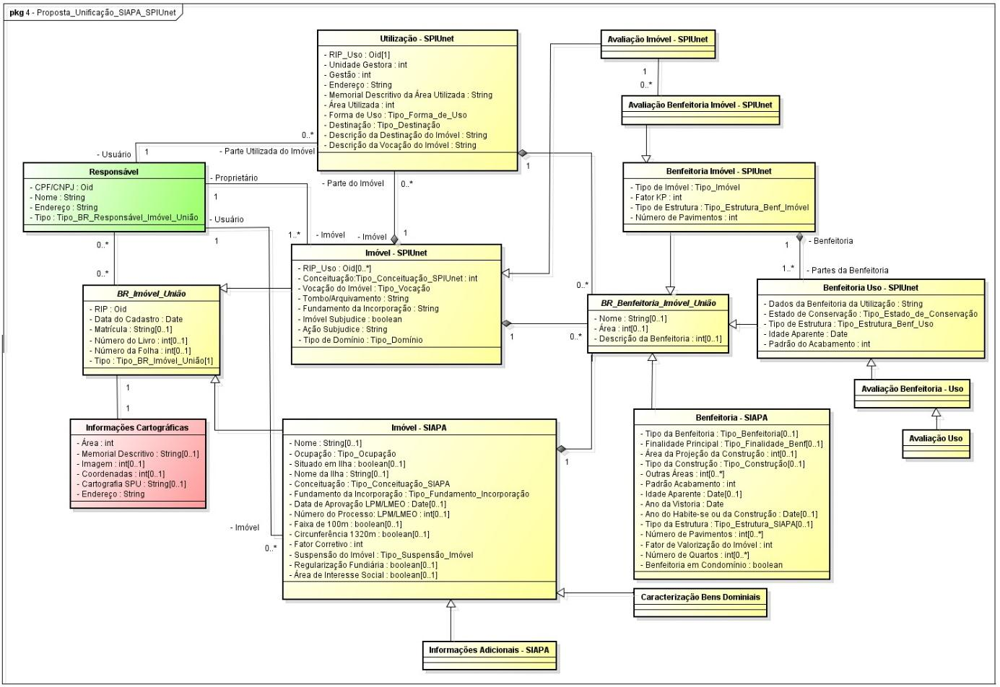
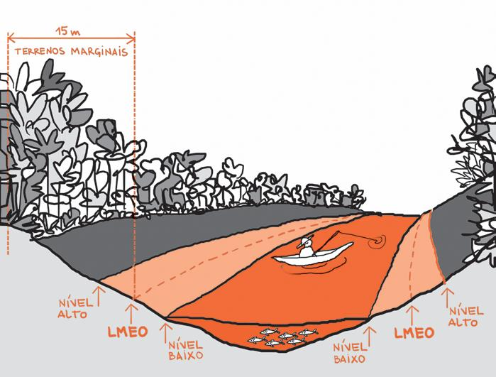

```{r setup, include=FALSE}
knitr::opts_chunk$set(echo = FALSE)
library(tibble)
library(sf)
library(leaflet)
library(knitr)
```

# Importância do cadastro de bens da União

---


---



---



---



---

{width=600px}

---




---




---




# Questões técnicas

---



## Decreto 8400/2015 {.emphasized}

- Estabelece os pontos apropriados para o traçado da Linha de Base do Brasil ao longo da costa brasileira continental e insular e dá outras providências.

- [link](http://www.planalto.gov.br/ccivil_03/_Ato2015-2018/2015/Decreto/D8400.htm).

## Decreto 8400/2015 | Linha de Base Reta

	
```{r cars}
lbr_SC <- tribble(
  ~Ponto, ~Longitude, ~Latitude, ~Label,
  83, -45.71, -24.11, "Ilha de Alcatrazes", 
  84, -46.16, -24.33, "Ilha Rochedos",
  85, -46.68, -24.49, "Ilha Queimada Grande",
  86, -48.03, -25.36, "Ilha da Figueira",
  87, -48.48, -26.18, "Ilha da Paz",
  88, -48.58, -26.78, "Ponta do Varrido",
  89, -48.33, -27.27, "Ilha Deserta",
  90, -48.35, -27.44, "Ilha do Badejo",
  91, -48.35, -27.49, "Ilha das Aranhas",
  92, -48.43, -27.85, "Ilha dos Moleques do Sul",
  93, -48.60, -28.35, "Ilha Tacami",
  94, -48.75, -28.54, "Ilha Leste",
  95, -48.81, -28.60, "Cabo de Santa Marta Grande")
```
  
```{r}
kable(head(lbr_SC))
```

  
## Mapa

```{r}
# LBR_SC <- st_linestring(as.matrix(lbr_SC[, c("Longitude", "Latitude")]))
lbr_SC %>%
  leaflet() %>%
  addTiles() %>%
  addCircleMarkers(~Longitude, ~Latitude, label = ~Label, radius = 2) %>%
  addPolylines(~Longitude, ~Latitude)
```

## Situação SPU

1. Cessão de Espaço Aquático / Certidão de Disponibilidade

Fases:

* Cadastro
* Análise Documental
* Avaliação
* Elaboração do Contrato de Cessão

## Exemplo

[Exemplo de Processo Cessão](../Cessao_Deter.pdf)


