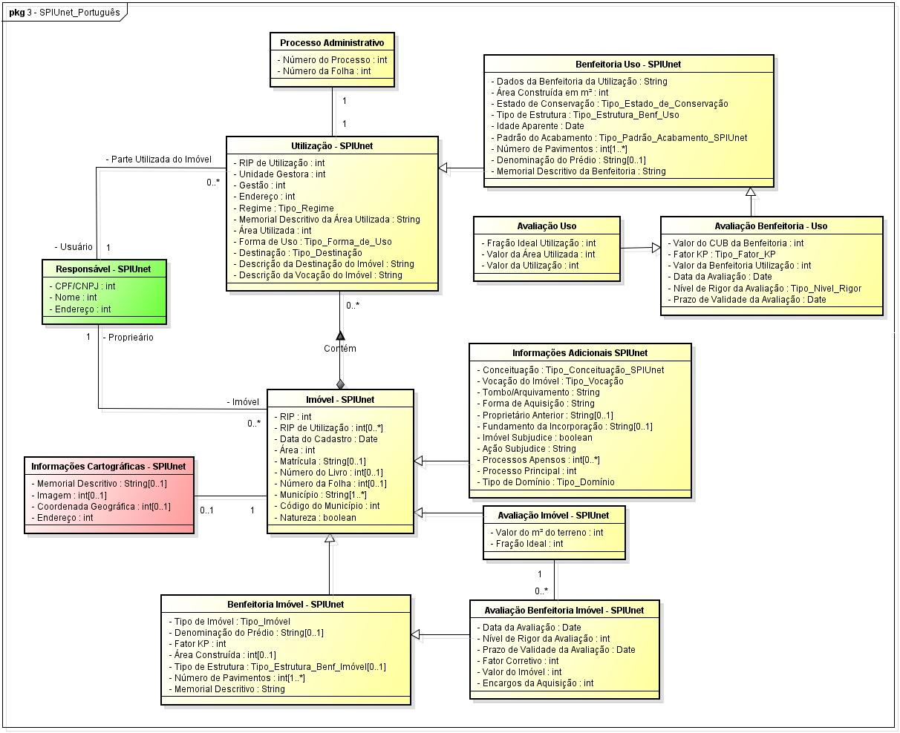
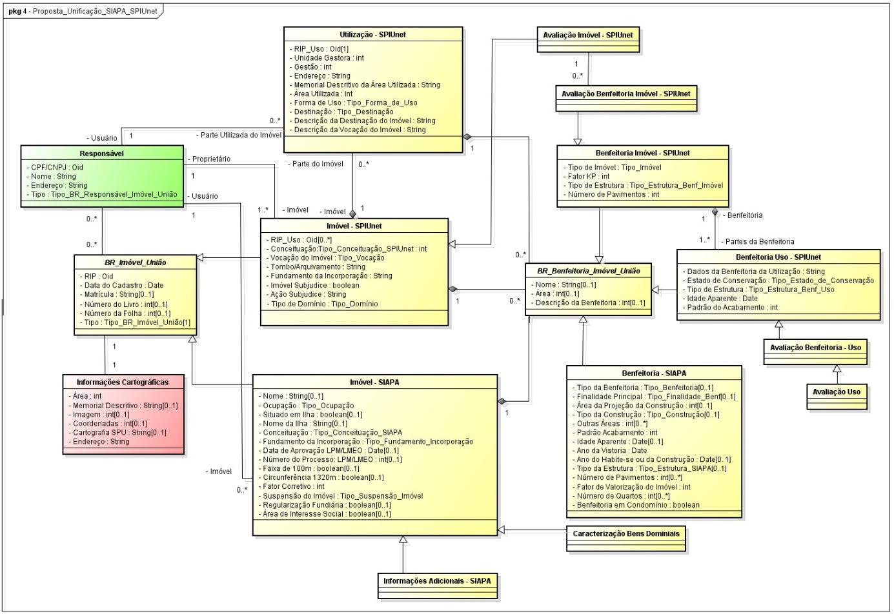
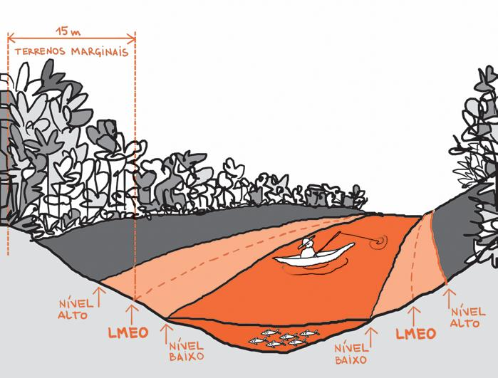

# Importância do cadastro de bens da União

---

---

---

---

---

{width=600px}

---

---

---

# Questões técnicas

---

## Decreto 8400/2015 {.emphasized}

- Estabelece os pontos apropriados para o traçado da Linha de Base do Brasil ao longo da costa brasileira continental e insular e dá outras providências.

- [link](http://www.planalto.gov.br/ccivil_03/_Ato2015-2018/2015/Decreto/D8400.htm).

## Decreto 8400/2015 | Linha de Base Reta

	

  

 Ponto   Longitude   Latitude  Label                
------  ----------  ---------  ---------------------
    83      -45.71     -24.11  Ilha de Alcatrazes   
    84      -46.16     -24.33  Ilha Rochedos        
    85      -46.68     -24.49  Ilha Queimada Grande 
    86      -48.03     -25.36  Ilha da Figueira     
    87      -48.48     -26.18  Ilha da Paz          
    88      -48.58     -26.78  Ponta do Varrido     

  
## Mapa

<!--html_preserve-->

<!--/html_preserve-->

## Situação SPU

1. Cessão de Espaço Aquático / Certidão de Disponibilidade

Fases:

* Cadastro
* Análise Documental
* Avaliação
* Elaboração do Contrato de Cessão

## Exemplo

[Exemplo de Processo Cessão](../Cessao_Deter.pdf)

